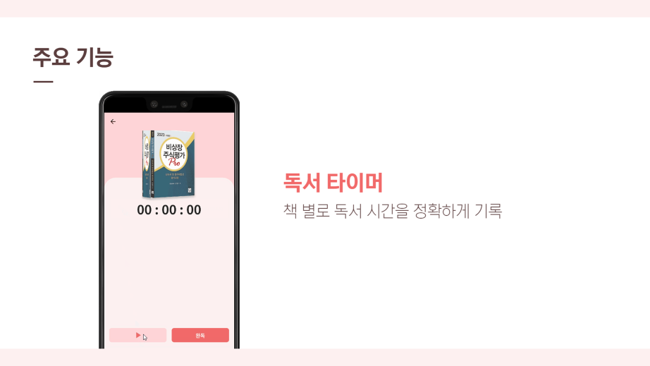
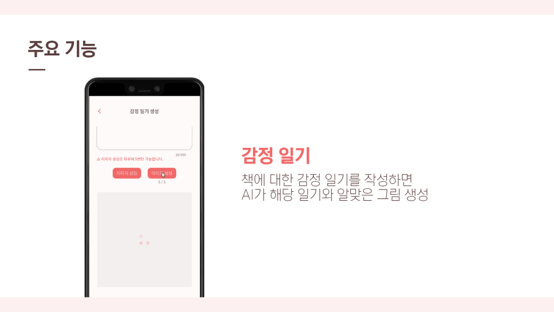
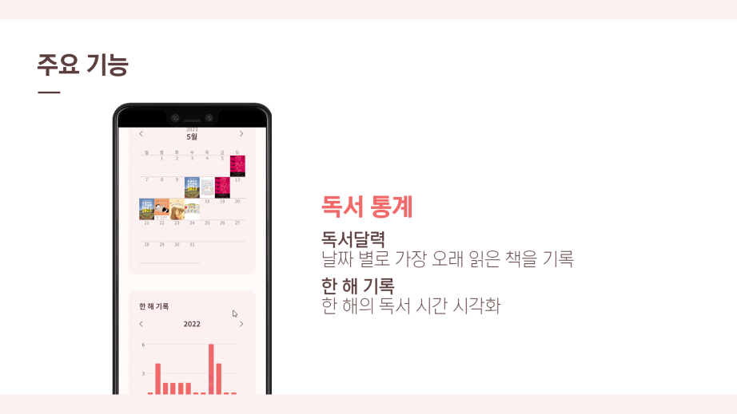
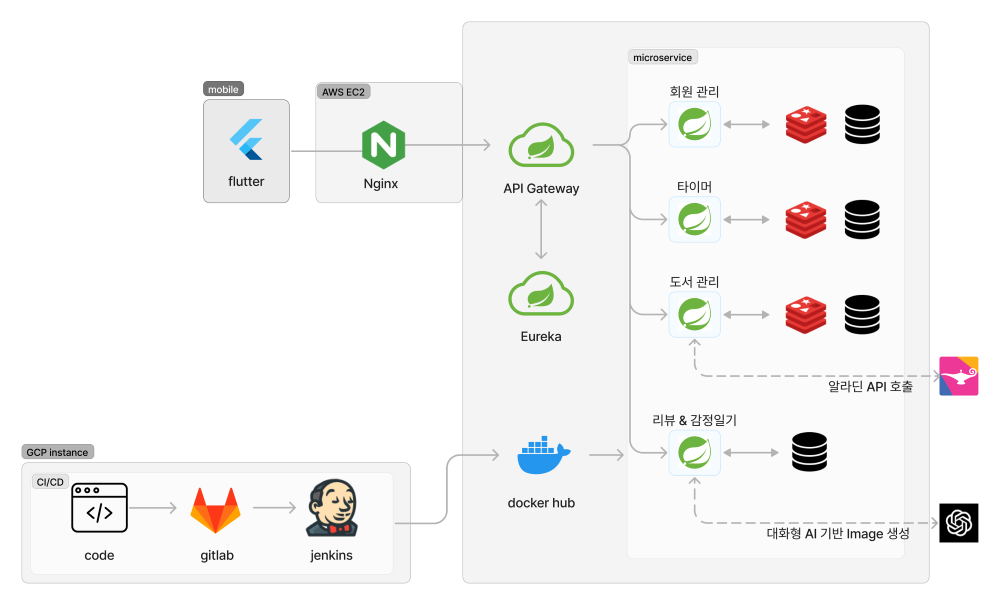
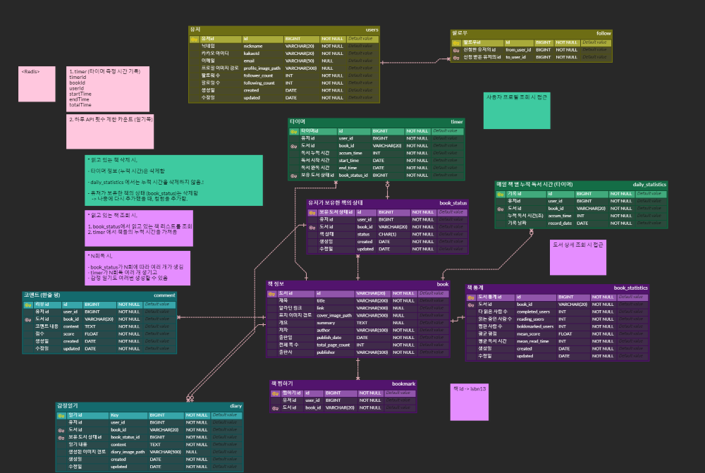

 

    <h3></h3>
    <h3> 독서기록을 바탕으로 나만의 AI 이미지 기록을 할 수 있는 독서기록앱 </h3>
    <h3>👉👉<a href="https://m.onestore.co.kr/mobilepoc/apps/appsDetail.omp?prodId=0000769537"> One Store</a> App Download 👈👈</h3>
    <h4>(Only Android)</h4>
    

 

## :deciduous_tree: 프로젝트 개요

### 프로젝트 기간

-   기획 및 설계 : 23.04.10 ~ 23.04.16
-   프로젝트 개발 : 23.04.17 ~ 23.05.19 (5주)

### 구성원

-   백엔드 3명
-   프론트엔드 2명

<table>
  <tbody>
    <tr>
      <td align="center">
        <a href="https://github.com/nimusmix">
            
             
            <b>팀장 김수민</b>
        </a>
        
FE 팀원

      </td>
       
      <td align="center">
        <a href="https://github.com/noonmap">
            
             
            <b>팀원 정채원</b>
        </a>
         
        
BE 팀원, CI/CD 담당

      </td>
       
      <td align="center">
        <a href="https://github.com/kamoo2">
            
             
            <b>팀원 문석환</b>
        </a>
         
        
FE 팀장

      </td>
    </tr>
    <tr>
      <td align="center">
        <a href="https://github.com/bnuri00">
            
             
            <b>팀원 김빛누리</b>
        </a>
         
        
BE 팀원

      </td>
      <td align="center">
        <a href="https://github.com/leeflection">
            
             
            <b>팀원 이재혁</b>
        </a>
         
        
BE 팀장

      </td>
    </tr>
    </tbody>
</table>

   

## 목차

[1. 프로젝트 소개](#1-프로젝트-소개)

[2. 기술 스택](#2-기술-스택)

[3. 주요 기능](#3-주요기능)

[4. 화면 상세](#-화면-상세)

[5. 아키텍처](#5-아키텍처)

[6. 프로젝트 설계 문서](#6-프로젝트-설계-문서)

## 1. 프로젝트 소개

 
독서 습관이 없는 사람들을 위해 동기를 부여해주고 독서에 몰입할 수 있는 환경을 제공하는 독서 기록앱입니다.
     
     

## 2. 기술 스택

|   Part    |                                                                                                                                                                                                                                                                                                                 Tech ⚙                                                                                                                                                                                                                                                                                                                 |
| :-------: | :------------------------------------------------------------------------------------------------------------------------------------------------------------------------------------------------------------------------------------------------------------------------------------------------------------------------------------------------------------------------------------------------------------------------------------------------------------------------------------------------------------------------------------------------------------------------------------------------------------------------------------: |
|  **FE**   |                                                                                                                                                                                                                        |
|  **BE**   |  |
| **Infra** |                                                                                                                                                                                                         |

## 3. 주요 기능

## 4. 화면 상세

## 5 아키텍처

## 6. 프로젝트 설계 문서

-   ERD
    
